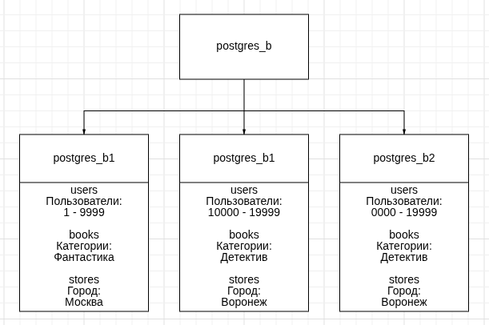
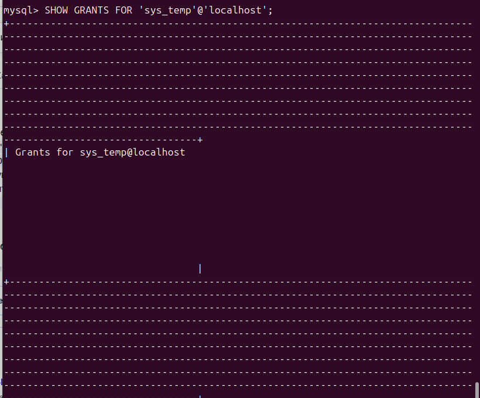
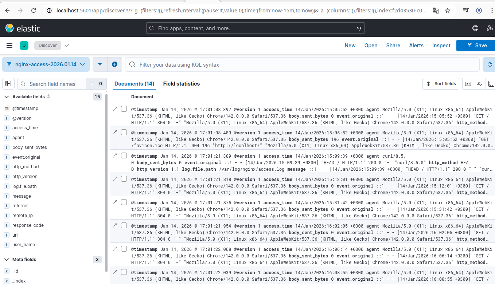
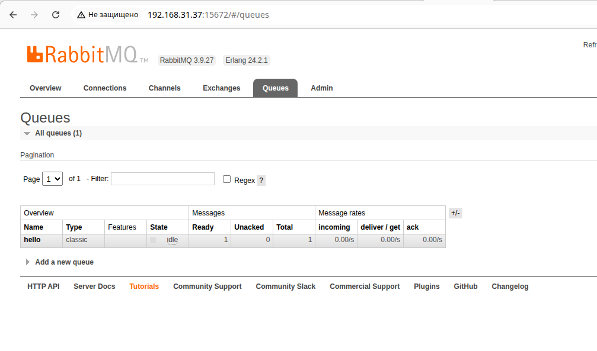

# Домашнее задание к занятию 3 "Работа с данными (DDL/DML)" - Карпов Антон Юрьевич

## Задание 1

1.1. Поднимите чистый инстанс MySQL версии 8.0+. Можно использовать локальный сервер или контейнер Docker.

1.2. Создайте учётную запись sys_temp.

1.3. Выполните запрос на получение списка пользователей в базе данных. (скриншот)

1.4. Дайте все права для пользователя sys_temp.

1.5. Выполните запрос на получение списка прав для пользователя sys_temp. (скриншот)

1.6. Переподключитесь к базе данных от имени sys_temp.

Для смены типа аутентификации с sha2 используйте запрос:

ALTER USER 'sys_test'@'localhost' IDENTIFIED WITH mysql_native_password BY 'password';
1.6. По ссылке https://downloads.mysql.com/docs/sakila-db.zip скачайте дамп базы данных.

1.7. Восстановите дамп в базу данных.

1.8. При работе в IDE сформируйте ER-диаграмму получившейся базы данных. При работе в командной строке используйте команду для получения всех таблиц базы данных. (скриншот)

Результатом работы должны быть скриншоты обозначенных заданий, а также простыня со всеми запросами.

## Решение 1

Список пользователей:



Права пользователя sys_temp:





Получение всех таблиц базы данных:


### Список запросов:

```
#SQL

CREATE USER sys_temp@localhost IDENTIFIED BY 'password';
SELECT user FROM mysql.user;
SHOW GRANTS FOR 'sys_temp'@'localhost';
exit;

#подключаемся в командной строке linux через пользователя sys_temp
mysql -u sys_temp -p

#SQL
exit;

#возвращаемся в консоль linux
wget https://downloads.mysql.com/docs/sakila-db.zip && unzip sakila-db.zip -d /home/karpov/homework/sql1

#SQL
CREATE DATABASE sakila;

#linux, восстановление базы из дампа:
mysql -u sys_temp -p sakila < /home/karpov/homework/sql1/sakila-db/sakila-schema.sql
mysql -u sys_temp -p sakila < /home/karpov/homework/sql1/sakila-db/sakila-data.sql

#SQL
mysql -u sys_temp -p
SHOW TABLES FROM sakila;

```

## Задание 2. Отправка и получение сообщений

Составьте таблицу, используя любой текстовый редактор или Excel, в которой должно быть два столбца: в первом должны быть названия таблиц восстановленной базы, во втором названия первичных ключей этих таблиц. Пример: (скриншот/текст)

Название таблицы | Название первичного ключа
customer         | customer_id

## Решение 2

[Ссылка на таблицу](tables.csv)


## Задание 3*

3.1. Уберите у пользователя sys_temp права на внесение, изменение и удаление данных из базы sakila.

3.2. Выполните запрос на получение списка прав для пользователя sys_temp. (скриншот)

Результатом работы должны быть скриншоты обозначенных заданий, а также простыня со всеми запросами.

## Решение 3

Просмотр прав у sys_temp:



### Запросы:

```
#SQL
REVOKE ALL PRIVILEGES, GRANT OPTION FROM 'sys_temp'@'localhost';
GRANT SELECT ON sakila.* TO 'sys_temp'@'localhost';
```


