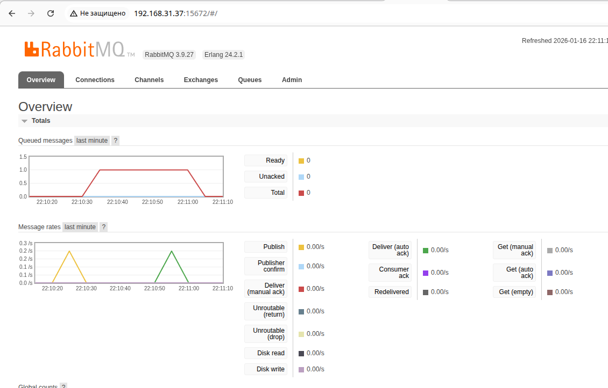
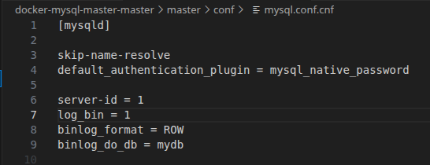
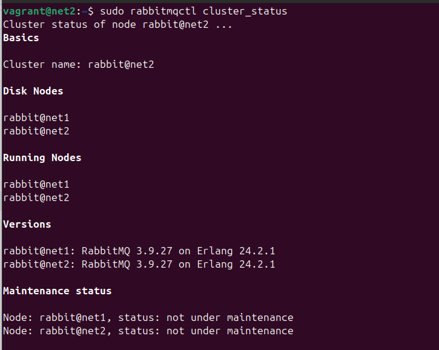
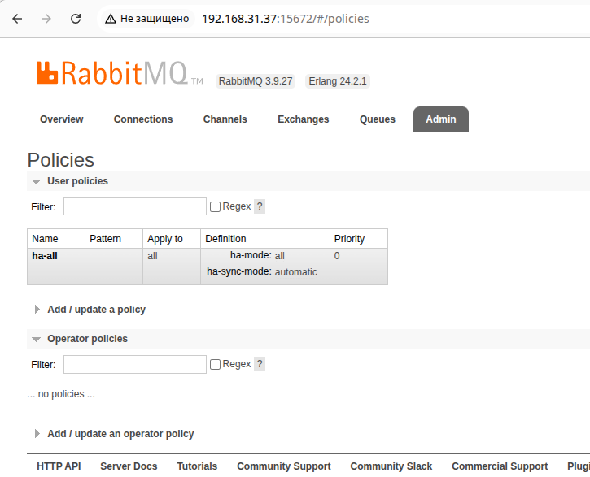
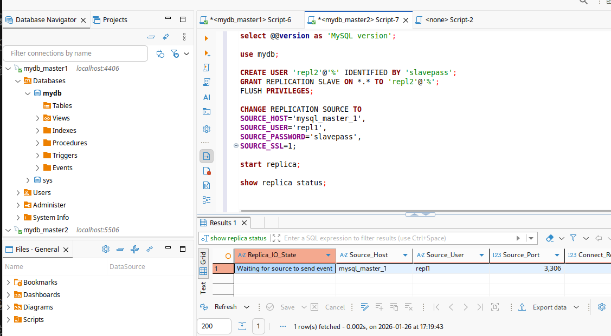
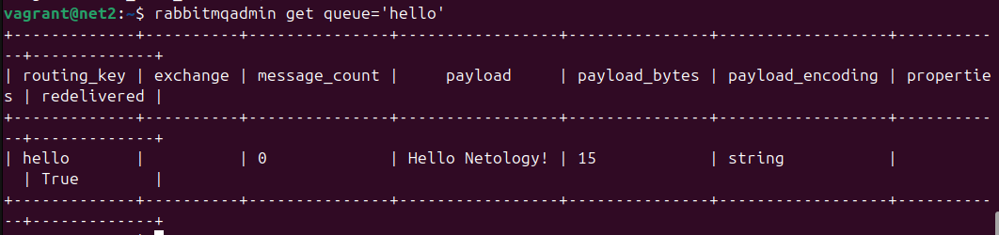
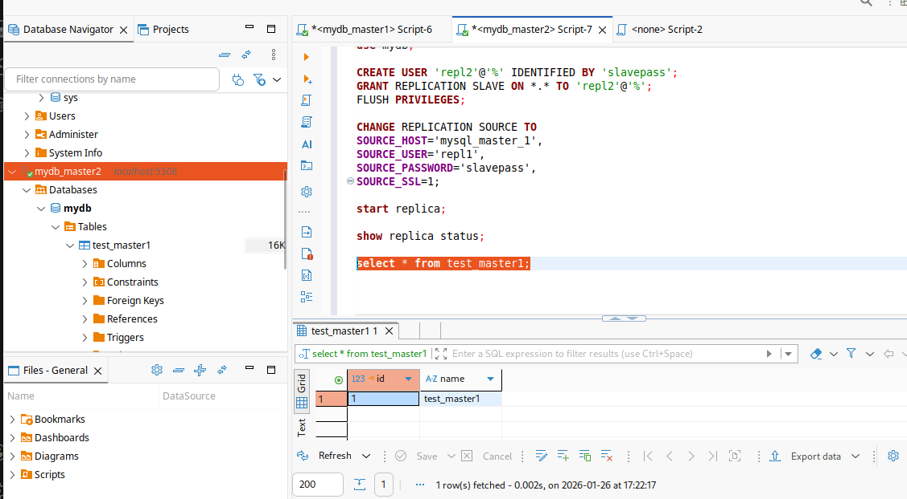
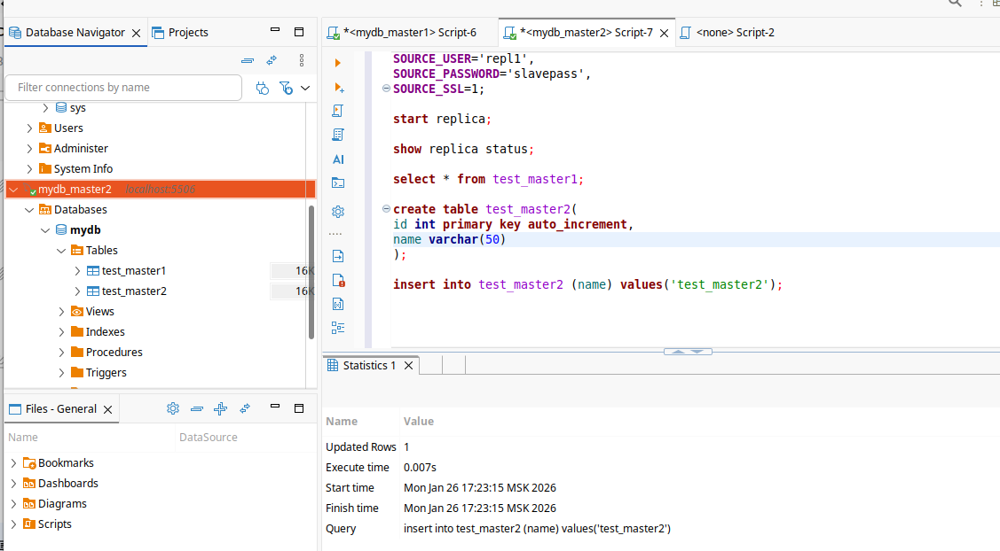
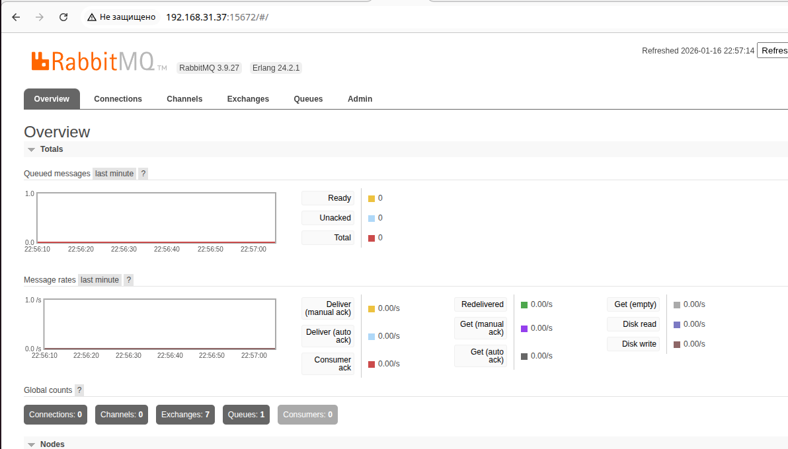

# Домашнее задание к занятию "Репликация и масштабирование. Часть 1" - Карпов Антон Юрьевич

## Задание 1

На лекции рассматривались режимы репликации master-slave, master-master, опишите их различия.

Ответить в свободной форме.

## Решение 1


## Задание 2

Выполните конфигурацию master-slave репликации, примером можно пользоваться из лекции.

Приложите скриншоты конфигурации, выполнения работы: состояния и режимы работы серверов.

## Решение 2

Т.к. в задании не указано, для какой СУБД нужно выполнить, сделал на двух.

### MySQL

Конфигурация мастера:

 или [тут](docker-mysql-master-slave-master/master/conf/mysql.conf.cnf)

Конфигурация слейва:

 или [тут](docker-mysql-master-slave-master/slave/conf/mysql.conf.cnf)

Статус реплики (результат выполнения запроса SHOW REPLICA STATUS):

[replica_status](_show_replica_status__202601261130.csv)

Проверка работы репликации:

```
#SQL - на мастере
create table test(
id int primary key auto_increment,
name varchar(50)
);

insert into test (name) values('test1');
```

Результат:


Выполнение запроса на слейве:


### PostgreSQL

Конфигурация мастера:
[postgresql.conf](pg-replica-master/master/postgresql.conf)

Конфигурация слейва:
[postgresql.conf](pg-replica-master/slave/postgresql.conf)

Статус репликации после выполнения запроса на мастере
```
select * from pg_stat_replication;
``` :
[g_stat_replication](pg_stat_replication_202601261509.csv)

Статус репликации после выполнения запроса на слейве
```
select * from pg_stat_wal_receiver;
``` :
pg_stat_wal_receiver_202601261515.csv

Проверяем репликацию. Выполняем на мастере запросы:
```
create table test(
id int primary key GENERATED ALWAYS as identity,
name varchar(50)
);

insert into test (name) values('test1');
```

Результат:


Проверяем на слейве:




## Задание 3*

Выполните конфигурацию master-master репликации. Произведите проверку.

Приложите скриншоты конфигурации, выполнения работы: состояния и режимы работы серверов.

## Решение 3

Конфигурация master1:

 или [тут](docker-mysql-master-master/master/conf/mysql.conf.cnf)

Конфигурация master2:

 или [тут](docker-mysql-master-master/slave/conf/mysql.conf.cnf)

Запрос show replica status на мастере1:



[Ссылка](_show_replica_status_from_master1__202601261718.csv)

Запрос show replica status на мастере2:



[Ссылка](_show_replica_status_from_master1__202601261718.csv)

Создаем таблицу test_master1 на master1:



Проверяем ее наличие на master2:



Идем в обратную сторону - создаем таблицу test_master2 на master2:



Проверяем наличие в master1:




