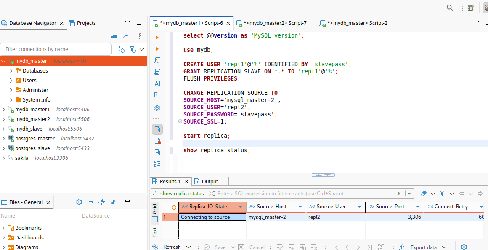

# Домашнее задание к занятию 3 "Кеширование Redis/memcached" - Карпов Антон Юрьевич

## Задание 1. Кеширование

Приведите примеры проблем, которые может решить кеширование.

Приведите ответ в свободной форме.

## Решение 1

* Долгая загрузка веб-страниц с "тяжелым" контентом - сокращение повторной загрузки одних и тех же файлов.
* Тяжелые запросы к БД - отдавая из кэша, снижается число обращений к БД.
* Низкопроизводительные системы - кэширование хранит часто используемые данные, тем самым сокращая время ответа.
* Пиковые нагрузки - сглаживает пики и уменьшает риск падения сервиса (например, распродажи в интернет-магазине).

## Задание 2. Memcached

Установите и запустите memcached.

Приведите скриншот systemctl status memcached, где будет видно, что memcached запущен.

## Решение 2

Демонстрация запущенного memcached:

## Задание 3. Удаление по TTL в Memcached

Запишите в memcached несколько ключей с любыми именами и значениями, для которых выставлен TTL 5.

Приведите скриншот, на котором видно, что спустя 5 секунд ключи удалились из базы.

## Решение 3

Скриншот:

## Задание 4. Запись данных в Redis

Запишите в Redis несколько ключей с любыми именами и значениями.

Через redis-cli достаньте все записанные ключи и значения из базы, приведите скриншот этой операции.

## Решение 4

Создание ключей:

Получение ключей со значениями:

Также можно получить с помощью одной команды MGET:

## Задание 5*. Работа с числами

Запишите в Redis ключ key5 со значением типа "int" равным числу 5. Увеличьте его на 5, чтобы в итоге в значении лежало число 10.

Приведите скриншот, где будут проделаны все операции и будет видно, что значение key5 стало равно 10.

## Решение 5

Сделал с помощью команды incrby, чтобы сразу увеличить на нужное значение:

Можно прибавлять и по одному:

 

