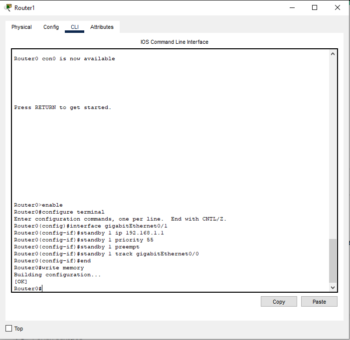
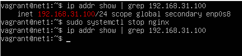
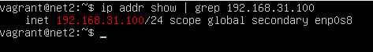
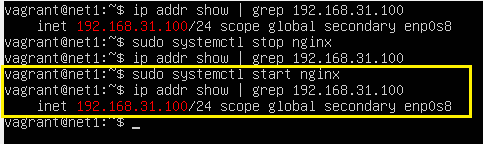
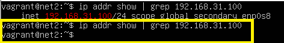

# Домашнее задание к занятию "Disaster recovery и Keepalived" - Карпов Антон Юрьевич

## Задание 1

* Дана схема для Cisco Packet Tracer, рассматриваемая в лекции.
* На данной схеме уже настроено отслеживание интерфейсов маршрутизаторов Gi0/1 (для нулевой группы)
* Необходимо аналогично настроить отслеживание состояния интерфейсов Gi0/0 (для первой группы).
* Для проверки корректности настройки, разорвите один из кабелей между одним из маршрутизаторов и Switch0 и запустите ping между PC0 и Server0.
* На проверку отправьте получившуюся схему в формате pkt и скриншот, где виден процесс настройки маршрутизатора.

## Решение 1

[Схема в формате pkt](<hsrp_hw.pkt>)

Процесс настройки:

## Задание 2

* Запустите две виртуальные машины Linux, установите и настройте сервис Keepalived как в лекции, используя пример конфигурационного файла.
* Настройте любой веб-сервер (например, nginx или simple python server) на двух виртуальных машинах
* Напишите Bash-скрипт, который будет проверять доступность порта данного веб-сервера и существование файла index.html в root-директории данного веб-сервера.
* Настройте Keepalived так, чтобы он запускал данный скрипт каждые 3 секунды и переносил виртуальный IP на другой сервер, если bash-скрипт завершался с кодом, отличным от нуля (то есть порт веб-сервера был недоступен или отсутствовал index.html). Используйте для этого секцию vrrp_script
* На проверку отправьте получившейся bash-скрипт и конфигурационный файл keepalived, а также скриншот с демонстрацией переезда плавающего ip на другой сервер в случае недоступности порта или файла index.html

## Решение 2

[Bash-скрипт:](check_web.sh)

[Настройки keepalived.conf на MASTER](keepalived.conf)

[Настройки keepalived.conf на BACKUP](keepalived_backup.conf)

### Демонстрация работы

Проверяем, что VIP настроен на мастере, останавливаем nginx и проверяем снова:

Идем на машину backup и проверяем, перешел ли ей VIP:

Возвращаемся снова на master, запускаем nginx, VIP снова на ней:

На backup снова его нет:

 

